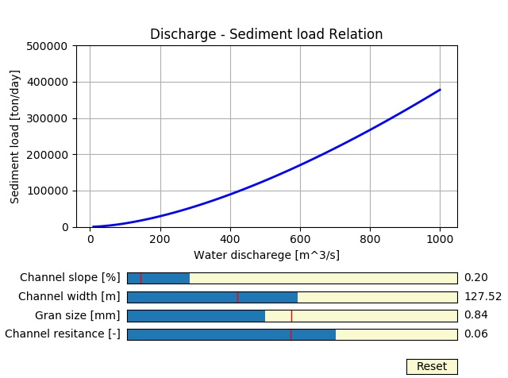

# 1.0 Introduction

This module is called "Module for flow discharge and sediment load relation in a river". 
It is designed to predict the sediment load (mass of sediment per unit time) for given water discharge (volume per unit time) in a river. 
For specified channel bed slope, channel width, bed surface grain size, and channel resistance coefficient, it produces a graph showing the relation between water discharge and sediment load. 

Sediment transport is typically describes as a function of shear stress at the channel bed. 
In general, deeper flow corresponds to higher bed shear stress; hence sediment load increases with increasing water discharge. 
Wider channel tends to have less capacity of sediment transport because wider channel corresponds to shallower flow for given water discharge, therefore lower bed shear stress. 
Steeper channel (or higher slope) is able to transport more sediment. 
When grain is fine, the sediment transport increases because fine sediment is easy to be picked up and carried away, compared to coarse grain. 
Higher bed resistance (e.g. bumpy bed) can reduce bed shear stress. That is to say, higher bed resistance causes lower sediment transport.

Details on the theoretical background is summarized in the document that can be found here.

# 2.0 Installation and setup guides

## 2.1 Install Python
This module requires users to be in python emvironment. 
For those who do not have Python on the computer, it is highly recommended to install Anaconda, which is an open source distribution of Python. 
It comes with basic laiblaries, some of which are used in the module. 
Anaconda can be dowloaded at https://www.anaconda.com/download/ for Windows, macOS, and Linux. Please follow the instruction provided in the website as to how to install and setup Python on your computer.
As of December 21, 2017, it is confirmed that the module functions under the environments of both Python2.7 and Python3, and both Windows and Linux.
However, the use of Python2.7 is recommended, rather than Python3 since the module is developed under the environment of Python2.7. 

## 2.2 Download the Python code
* Visit the 'download' folder of this repository ([https://github.com/amoodie/research_outreach/tree/master/flooding_risk/download](./download)) and download the file named "module_discharge_sediment.py".

## 2.3 Excute the file to run the module
There are several ways of excuting the Python file to run the module. 

### IDLE editor

### Comand prompt 

# 3.0 Disclaimer

The module was created by Kensuke Naito as part of an National Science Foundation funded research project assessing the sustainability of anthropogenically influenced deltas.
The research is supported by National Science Foundation (NSF) Grant No. 1427262.
Any opinion, findings, and conclusions or recommendations expressed in this material are those of the author(s) and do not necessarily reflect the views of the NSF.
For more information, please contact Kensuke Naito at knaito2@illinois.edu.
